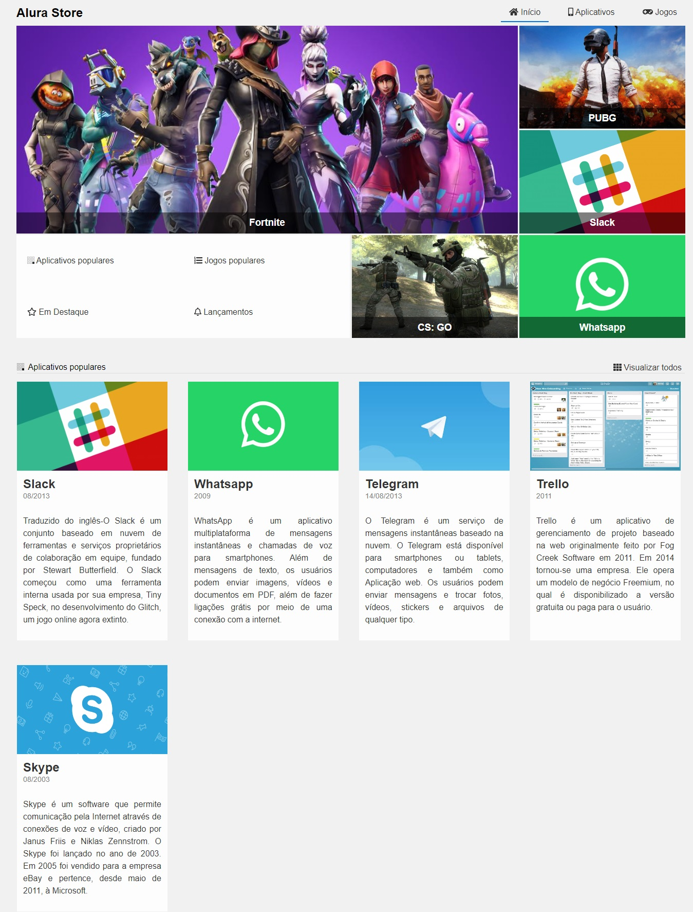

# 🎮 Alura Store

### Projeto Desenvolvido no curso de CSS Grid da Alura

 

  

## Tópicos

- [Imagem do projeto](#imagem-do-projeto)
- [Descrição do projeto](#descrição-do-projeto)
- [Acesso ao projeto](#acesso-ao-projeto)
- [Tecnologias utilizadas](#tecnologias-utilizadas)
- [Status do projeto](#status-do-projeto)
- [Licença](#licença)

 

## Imagem do projeto

    

 

## Descrição do projeto

A Alura Store é uma loja online que possui vários Apps e Games em seu catálogo.

 

## Acesso ao projeto

Clique [aqui](https://fel1324.github.io/AluraStore/) para acessar o projeto.

 

## Tecnologias utilizadas

* HTML e CSS
* Git e Github

 

## Status do projeto

✔️ PROJETO FINALIZADO

 

## Licença

Esse projeto está sob a licença MIT.
